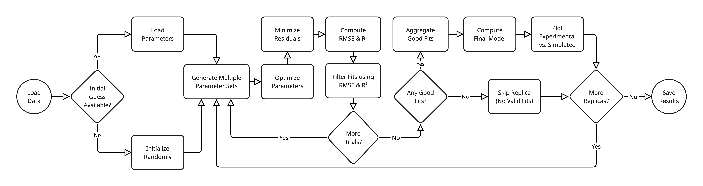

# Scientific Summary of the Molecular Binding Assay Fitting Toolkit

## 1. Introduction

This report provides a high-level overview of the scientific principles, mathematical frameworks, and algorithmic strategies employed by the Molecular Binding Assay Fitting Toolkit. The software is designed to analyze spectroscopic data from various molecular binding assays—specifically Guest Displacement Assays (GDA), Indicator Displacement Assays (IDA), and Direct Binding Assays (DBA). Its primary objective is to accurately quantify binding affinities (equilibrium constants) and physical response parameters (e.g., fluorescence coefficients) by fitting theoretical models directly to experimental observations.

## 2. Scientific Methodology: The Forward Modeling Approach

The core philosophy of this codebase is **Forward Modeling**. Traditional methods in supramolecular chemistry often rely on linearizing data (e.g., Scatchard or double-reciprocal plots) to extract binding constants. While computationally simple, these transformations distort the experimental error structure, leading to biased estimates and unreliable confidence intervals.

In contrast, this toolkit employs a direct non-linear regression approach:
1. **Model Prediction:** Based on a set of trial parameters (e.g., binding constants), the software simulates the exact concentrations of all chemical species at equilibrium.
2. **Signal Simulation:** It then calculates the expected physical signal (e.g., fluorescence intensity) corresponding to these concentrations.
3. **Optimization:** The algorithm iteratively adjusts the parameters to minimize the discrepancy between the simulated signal and the raw experimental data.

This approach preserves the native error distribution of the measurement, allows for the application of rigorous physical constraints (e.g., ensuring concentrations are non-negative), and enables the analysis of complex competitive systems that do not lend themselves to simple linearization.

## 3. Mathematical Framework

The mathematical engine of the toolkit is built upon the fundamental laws of chemical thermodynamics and mass conservation.

### 3.1. Law of Mass Action

The interactions are modeled as reversible equilibrium processes. For a simple 1:1 binding event between a Host ($H$) and a Guest ($G$), the equilibrium is governed by the association constant ($K_a$) or dissociation constant ($K_d$):
$$ H + G \rightleftharpoons HG $$
$$ K_a = \frac{[HG]}{[H][G]} $$

### 3.2. Mass Balance Equations

To solve for the unknown free concentrations ($[H]$, $[G]$) required by the mass action law, the software utilizes mass balance equations. These equations state that the total concentration of a species (a known experimental input) is the sum of its free form and its bound forms.

- **Direct Binding:** Leads to a system of equations that can be reduced to a **quadratic equation**, allowing for an analytical solution for the complex concentration.
- **Competitive Binding (GDA/IDA):** Involves two competing equilibria (Host-Dye and Host-Guest). This results in a more complex system that reduces to a **cubic equation** with respect to the free host concentration. Unlike the quadratic case, this often requires numerical solution methods to ensure stability and physical validity.

### 3.3. Signal Response Model

The observable signal ($I$) is modeled as a linear combination of the contributions from all active species. For a fluorescence assay, this follows the additive property of intensity:
$$ I = I_0 + \sum I_i [C_i] $$
Where $I_0$ is the background signal, $[C_i]$ is the concentration of species $i$, and $I_i$ is its molar response factor (e.g., brightness).

**Connecting Parameters to Measurement Data:**
The signal equation provides the critical link between the chemical model and the experimental data. The concentrations $[C_i]$ are determined by the binding constants ($K_a$) via the mass balance equations. Thus, the calculated signal depends directly on the unknown parameters ($K_a, I_i$). The fitting process simply adjusts these parameters until the calculated signal matches the measured data.

The process works as a chain of dependencies:
1. **Input Parameters:** The algorithm starts with a guess for the unknown parameters: the binding constant ($K_a$) and the molar response factors ($I_i$).
2. **Chemical Equilibrium:** Using the $K_a$ and the known total concentrations of reagents, the mass balance equations are solved to determine the exact equilibrium concentration $[C_i]$ of every species in the solution.
3. **Signal Prediction:** These calculated concentrations are plugged into the signal equation above to predict what the instrument should read ($I_{calc}$).
4. **Comparison:** This predicted signal is compared to the actual measured data ($I_{obs}$). The difference (residual) guides the optimization algorithm to refine the parameters for the next cycle.
5. **Iteration:** Steps 1-4 are repeated until convergence is achieved, meaning the predicted signal closely matches the observed data within a defined tolerance. The resulted parameters ($K_a, I_i$) are then considered the best estimates.

## 4. Algorithmic Implementation

The toolkit integrates several classes of algorithms to solve the inverse problem of finding parameters that best explain the measurement data.

### 4.1. Numerical Optimization

The central engine uses **Bound-Constrained Quasi-Newton Methods** (specifically L-BFGS-B).
- **Role:** To navigate the multi-dimensional parameter space and find the set of values that minimizes the sum of squared residuals (the difference between measurement data and mathematical model).
- **Why this algorithm:** It efficiently handles "box constraints," allowing the software to enforce physical limits (e.g., binding constants must be positive) without computationally expensive penalty functions.

### 4.2. Root-Finding Algorithms

For competitive assays (GDA/IDA), the free host concentration cannot be isolated algebraically in a robust manner.
- **Role:** The software employs **Brent’s Method** (a robust root-finding algorithm combining bisection, secant, and inverse quadratic interpolation) to numerically solve the mass balance equation for every single data point during the fitting process.
- **Why this algorithm:** It guarantees convergence to a root within a bracketed interval, ensuring that the calculated concentrations are always physically meaningful (i.e., between zero and the total concentration).

### 4.3. Ensemble Statistics and Robustness

To address the inherent uncertainty in experimental data and the potential for local minima in non-linear fitting:
- **Ensemble Fitting:** The software employs a "multi-start" or bootstrap-like strategy, running the optimization multiple times from different initial guesses or on resampled data.
- **Robust Aggregation:** When combining results from multiple fitting attempts, the software uses **median-based statistics** (Median and Median Absolute Deviation) instead of traditional averages (Mean and Standard Deviation).
  - **Why:** Optimization algorithms can occasionally converge to incorrect solutions ("local minima") or be skewed by noisy data points. These "bad" fits act as outliers that would significantly distort a simple average.
  - **Benefit:** The median effectively ignores these outliers, ensuring that the reported binding constants represent the most consistent and reliable solution found across the ensemble of attempts.

### 4.4. Physical Constraints: Non-Negative Signal Intensities

All parameters representing physical signal intensities or association constants are **strictly non-negative**:

- $K_a > 0$ — association constants are ratios of concentrations at equilibrium.
- $I_0 \geq 0$ — baseline/background signal from the instrument.
- $I_{\text{dye,free}} \geq 0$ — molar response of free dye.
- $I_{\text{dye,bound}} \geq 0$ — molar response of bound dye (host-dye complex).

The optimizer enforces this via lower-bound constraints ($\geq 0$) on all signal parameters across all assay types. Functions that derive parameter bounds from prior fits (e.g. propagating dye-alone calibration results to downstream DBA/GDA/IDA fits) also clamp lower bounds to zero. Raw measured signals may occasionally appear negative due to instrument noise or baseline drift, but the underlying physical quantities being modelled are always non-negative.

## 5. Parameter Identifiability and Signal Coefficient Degeneracy

### 5.1. The Problem

The 4-parameter signal model $I = I_0 + I_{\text{dye,free}} [D_{\text{free}}] + I_{\text{dye,bound}} [HD]$ contains a **structural degeneracy** in certain assay configurations. Different combinations of $(I_0, I_{\text{dye,free}}, I_{\text{dye,bound}})$ can produce **identical predicted signals**, making these parameters individually non-identifiable from curve fitting alone.

### 5.2. Mathematical Origin

The degeneracy arises from the **mass conservation constraint** on the fixed species.

**IDA example** (fixed dye, $d_0$ constant):

From dye mass balance: $[D_{\text{free}}] = d_0 - [HD]$. Substituting into the signal equation:

$$I = I_0 + I_{\text{dye,free}}(d_0 - [HD]) + I_{\text{dye,bound}}[HD]$$

$$I = \underbrace{(I_0 + I_{\text{dye,free}} \cdot d_0)}_{\text{effective offset}} + \underbrace{(I_{\text{dye,bound}} - I_{\text{dye,free}})}_{\text{effective contrast}} \cdot [HD]$$

The three parameters $(I_0, I_{\text{dye,free}}, I_{\text{dye,bound}})$ collapse into **two effective degrees of freedom**: an offset and a contrast. Any parameter triplet satisfying the same offset and contrast produces an identical signal curve. This defines a **one-dimensional degenerate manifold** in parameter space.

**DBA example** (DtoH mode, fixed host $h_0$):

Similarly, host mass balance gives $[H_{\text{free}}] = h_0 - [HD]$. If the signal model uses $[H_{\text{free}}]$ as one of the species (as in the current quadratic solver), the same reduction applies:

$$I = (I_0 + I_{\text{dye,free}} \cdot h_0) + (I_{\text{dye,bound}} - I_{\text{dye,free}}) \cdot [HD]$$

Again, three parameters map to two effective quantities.

**GDA** has a weaker form of this degeneracy because both $[D_{\text{free}}]$ and $[HD]$ vary independently (dye is the titrant, so $d_0$ is not constant). However, in practice, the sensitivity surface for $K_{a,\text{guest}}$ is relatively flat when signal coefficient bounds are wide, making GDA fits less stable than DBA or IDA for $K_a$ recovery.

### 5.3. Consequences

| What is identifiable | What is NOT identifiable |
|---------------------|------------------------|
| $K_a$ (controls curve **shape** via equilibrium) | Individual $I_0$, $I_{\text{dye,free}}$, $I_{\text{dye,bound}}$ |
| Effective offset $(I_0 + I_{\text{dye,free}} \cdot c_{\text{fixed}})$ | Their individual contributions |
| Effective contrast $(I_{\text{dye,bound}} - I_{\text{dye,free}})$ | Decomposition into the two coefficients |
| Overall fit quality ($R^2$, RMSE) | Which parameter triplet is "correct" |

Practically this means:
- The optimizer can find a **perfect fit** ($R^2 \approx 1$) with the **wrong** signal coefficients.
- $K_a$ is reliably recovered regardless — it is the only parameter that affects the curve's inflection point and saturation behavior.
- Fitting with wide signal coefficient bounds typically produces artificially large or small values for $I_{\text{dye,free}}$ compensated by $I_0$.

### 5.4. Recommended Inspection Steps

To systematically demonstrate and inspect this degeneracy:

1. **Generate synthetic data** from known ground-truth parameters using the forward model.
2. **Fit with wide signal coefficient bounds** (e.g., $10^4$ to $10^{12}$ for both $I_{\text{dye,free}}$ and $I_{\text{dye,bound}}$).
3. **Compare fitted vs. true values**:
   - $K_a$ should be recovered within tolerance (≤10% for clean data).
   - $I_{\text{dye,free}}$ and $I_{\text{dye,bound}}$ will deviate significantly from truth (often $>50\%$  error), yet $R^2 \approx 1$.
4. **Verify degeneracy invariant**: Compute the effective offset and contrast from the fitted parameters — they should match the true values even when individual coefficients do not.
5. **Repeat with tight signal coefficient bounds** (±20% of truth): $K_a$ recovery improves because the degenerate manifold is constrained.
6. **Sweep $I_0$**: Fix $I_{\text{dye,free}}$ and $I_{\text{dye,bound}}$ at their true values, vary $I_0$, and recompute the signal — observe that offsetting $I_0$ by $\Delta$ and $I_{\text{dye,free}}$ by $-\Delta / c_{\text{fixed}}$ produces an identical curve.

### 5.5. Mitigation Strategies

- **Fix signal coefficients from a prior DBA calibration.** In the standard experimental workflow, DBA is performed first, and the resulting $I_{\text{dye,free}}$ and $I_{\text{dye,bound}}$ are treated as known constants in subsequent GDA/IDA fits. This eliminates the degeneracy entirely and is the scientifically correct approach.
- **Use tight bounds** (±20%) on signal coefficients when fitting, if fixing them is not feasible.
- **Set $I_0 = 0$** in synthetic test scenarios to reduce the parameter-space dimension and simplify optimizer convergence diagnostics.
- **Report the effective offset and contrast** rather than (or in addition to) the individual coefficients, since these are the physically identifiable quantities.

## 6. General Theoretical Workflow Diagram

